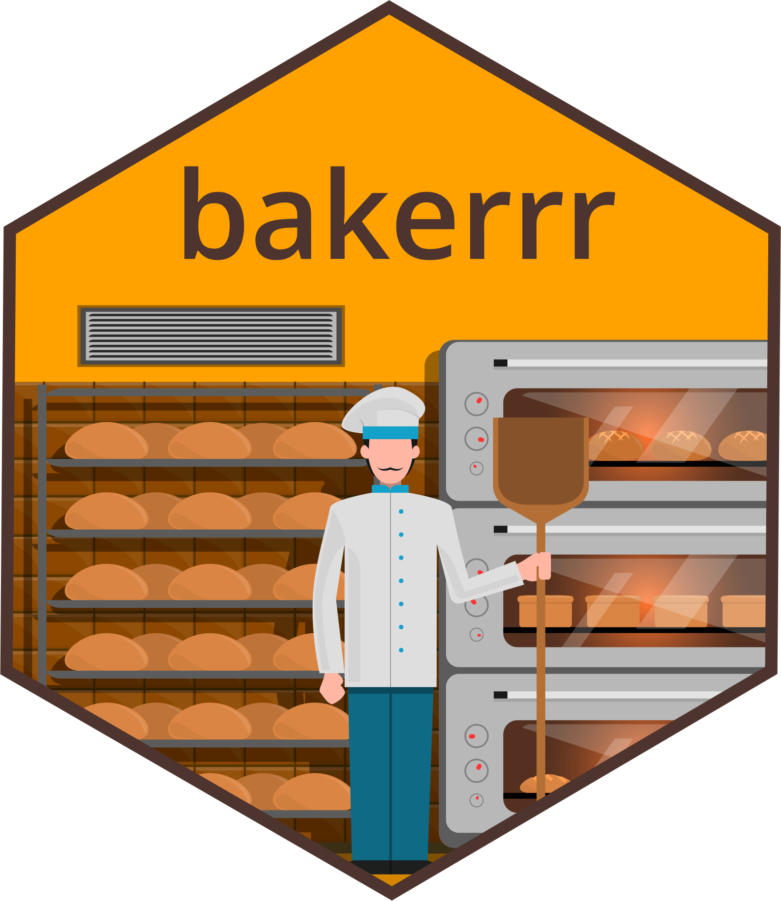

<!-- README.md is generated from README.Rmd. Please edit that file -->

# bakerrr ⏲️ <a href="https://anirbanshaw24.github.io/bakerrr/"></a>

<!-- badges: start -->

[](https://github.com/anirbanshaw24/bakerrr/actions/workflows/R-CMD-check.yml)
[](https://github.com/anirbanshaw24/bakerrr/actions/workflows/lintr-check.yml)
[](https://github.com/anirbanshaw24/bakerrr/actions/workflows/spell-check.yml)
[](https://github.com/anirbanshaw24/bakerrr/actions/workflows/test-coverage.yml)
[](https://app.codecov.io/gh/anirbanshaw24/bakerrr)
<!-- badges: end -->

## Elegant S7-based parallel job orchestration for R

provides a clean, modern interface for running background parallel jobs
using S7 classes, mirai daemons, and callr process management. Perfect
for computationally intensive workflows that need robust error handling
and progress monitoring.

## Features

- S7 Class System: Type-safe, modern R object system
- Parallel Processing: Efficient daemon-based parallelization via mirai
- Background Execution: Non-blocking job execution with callr::r_bg
- Error Resilience: Built-in tryCatch error handling per job
- Progress Monitoring: Console spinner with live status updates
- Flexible Configuration: Customizable daemon count and cleanup options
- Clean API: Intuitive print(), summary(), and
  run_jobs(wait_for_results) methods

## Installation

You can install the development version of bakerrr from
[GitHub](https://github.com/) with:

``` r
# Install from GitHub
pak::pak("anirbanshaw24/bakerrr")

# Or with devtools
devtools::install_github("anirbanshaw24/bakerrr")
```

## Quick Start

``` r
# Define your function
compute_sum <- function(x, y) {
  Sys.sleep(1)  # Simulate work
  x + y
}

# Create argument lists for each job
args_list <- list(
  list(x = 1, y = 2),
  list(x = 3, y = 4),
  list(x = 5, y = 6),
  list(x = 7, y = 8)
)

# Create and run bakerrr job
job <- bakerrr::bakerrr(
  fun = compute_sum,
  args_list = args_list,
  n_daemons = 2
) |> 
  bakerrr::run_jobs(wait_for_results = TRUE)

# Check results
job@results
#> [[1]]
#> [1] 3
#> 
#> [[2]]
#> [1] 7
#> 
#> [[3]]
#> [1] 11
#> 
#> [[4]]
#> [1] 15
#> [[1]] [1] 3
#> [[2]] [1] 7  
#> [[3]] [1] 11
#> [[4]] [1] 15

print(job)
#> ✅ bakerrr
#> ├─ Status: COMPLETED
#> ├─ Function: compute_sum
#> ├─ Args: 4 sets
#> ├─ Daemons: 2
#> ├─ Cleanup: enabled
#> ├─ Process alive: FALSE
#> ├─ Result:
#> │  └─ List with 4 elements
```

## Advanced Usage

### Error Handling

``` r
# Function that may fail
risky_function <- function(x) {
  if (x == "error") stop("Intentional error")
  x * 2
}

args_list <- list(
  list(x = 5),
  list(x = "error"),  # This will fail gracefully
  list(x = 10)
)

job <- bakerrr::bakerrr(risky_function, args_list) |>
  bakerrr::run_jobs(wait_for_results = FALSE)
job@results
#> [1] "sleeping"
#> [[1]] [1] 10
#> [[2]] [1] "Error in purrr::in_parallel: Intentional error"
#> [[3]] [1] 20
```

### Background Job Arguments

``` r
# Custom logging and process options
job <- bakerrr::bakerrr(
  fun = compute_sum,
  args_list = args_list,
  bg_args = list(
    stdout = "job_output.log",
    stderr = "job_errors.log",
    supervise = TRUE
  )
) |>
  bakerrr::run_jobs(wait_for_results = FALSE)
```

### Asynchronous Execution

``` r
long_running_function <- function() {
  Sys.sleep(5)
}
# Start job without waiting
job <- bakerrr::bakerrr(long_running_function, args_list) |> 
  bakerrr::run_jobs(wait_for_results = FALSE)

# Check status later
summary(job)
#>           Length           Class1           Class2             Mode 
#>                1 bakerrr::bakerrr        S7_object           object
#> ⏳ BackgroundParallelJob [running] - 4 daemons, 10 jobs

# Get results when ready
if (!job@bg_job_status$is_alive()) {
  results <- job@results
}
```

## Performance Tips

- Optimal Daemon Count: Start with ceiling(cores / 5), adjust based on
  workload
- Batch Size: Group small tasks to reduce overhead
- Memory Usage: Monitor with bg_args = list(supervise = TRUE)
- Error Recovery: Use tryCatch in your functions for custom error
  handling

## Dependencies

- S7: Modern object system
- mirai: High-performance parallelization
- callr: Background R processes
- purrr: Functional programming toolkit
- cli: Progress indicators
- glue: String interpolation
